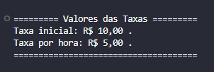
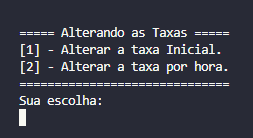

# 📚 Sistema de Estacionamento 🚗
Este projeto é uma aplicação de console desenvolvida em .NET(C#) para gerenciar um estacionamento. Ele permite definir a capacidade do estacionamento, configurar taxas e controlar a entrada e saída de veículos.

---

## **⚒️ Tecnologias utilizadas**

* .NET (C#)
    - [Newtonsoft.json](https://www.nuget.org/packages/Newtonsoft.Json)
* Git/GitHub

---

## 🔧 Funcionalidades
* Estacionamento:
    - Definir capacidade total de vagas
    - Definir taxa inicial
    - Definir taxa por hora
    - Alterar taxas
* Carros  
    - Adicionar veículo ao estacionamento
    - Retirar veículo ao estacionamento
    - Mostrar todos os veículo estacionados
 * Persistência dos dados localmente em arquivo `.json`

---

## 📂 Estrutura de Pastas

```
sistema-de-estacionamento/
├── LocalDB/
│   └── estacionamento.json
├── Models/
│   └── Estacionamento.cs
├── .gitignore
├── Programa.cs
├── Sistema_de_Estacionamento.csproj
├── Sistema_de_Estacionamento.sln
└── README.md
```

---

## 💾 Salvamento Local com JSON

O sistema salva as configurações do estacionamento e dos de veículos localmente, utilizando o arquivo:

```
LocalDB/estacionamento.json
```

Exemplo de estrutura JSON:

```json
{
  "TaxaInicial": 5.0,
  "TaxaPorHora": 2.0,
  "Capacidade" : "10",
  "Carros": [
    "ABC-1234",
    "XYZ-9876"
  ]
}
```

---

## 📸 Vídeo de Desmonstração

### 🟣 Menu de Taxas


### 🟣 Menu de Alterar Taxas


### 🟣 Função Adicionar, Retirar e Mostrar Carros 
[](https://youtu.be/-LfQIChqLwA)

---

## 🚀 Como Executar o Projeto

1️⃣ **Clone o repositório:**

   ```bash
   git clone https://github.com/brunopaz8/sistema-de-estacionamento.git
   ```

2️⃣ **Navegue até o diretório do projeto:**

   ```bash
   cd sistema-de-estacionamento
   ```

3️⃣ **Compile e execute o projeto:**

   ```bash
   dotnet run
   ```

   > Certifique-se de ter o [.NET SDK](https://dotnet.microsoft.com/download) instalado em sua máquina.

---

## 📌 Observações

* O sistema considera letras maiúsculas/minúsculas no número da placa.
* Os dados não salvos serão perdidos.


